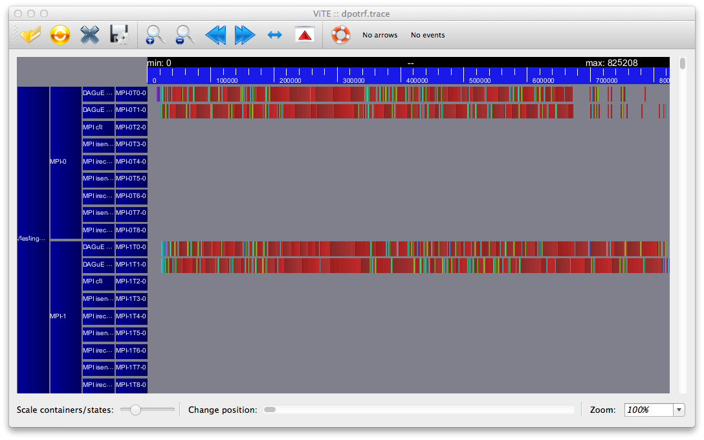

# Basic Profiling #

In many instances it might be interesting to extract and use information about the task cost and performance. This allows analysis of the scheduling quality, the maintained memory locality and the time wasted due to scheduling decisions. Achieving this requires a complete recompilation of the PaRSEC source after enabling the PARSEC_PROF_TRACE CMake option.

In case you are on a system with accelerators and you need to be able to extract profiling information from the execution of tasks on these accelerators you have to hand edit the src/gpu_data.c file and add the information you want to profile to the ```parsec_cuda_trackable_events``` variable. Here is a quick description of the available values:

* PARSEC_PROFILE_CUDA_TRACK_EXEC shows the task submission and retrieval time. This does not include the time required to move the data to and from the accelerator.

* PARSEC_PROFILE_CUDA_TRACK_DATA_IN tracks the movement of data from the main memory to the accelerator memory. This operation can be skipped if the data is already available on the accelerator memory due to a previous operation.

* PARSEC_PROFILE_CUDA_TRACK_DATA_OUT tracks the data movement from the accelerator memory back to the main memory after the completion of a task. This operation can be delayed until the data is needed by a task that will execute on the CPU.

* PARSEC_PROFILE_CUDA_TRACK_OWN shows the threads that own the accelerator, in the sense that it will manage the tasks submission and data movements.

To generate the profiling trace output, python or cython is not a requirement (we can generate the binary trace data). But in order to convert that into HDF5 format data, your PaRSEC build environment should have Python3 loaded, and Cython loaded as well. During CMake, make sure that your Python and Cython have been detected. On saturn/methane, the following series of module loads should work:

```
module load python
module load py-cython
module load py-tables # python will import from this later
module load py-pandas # python will import from this later
```

Using DPLASMA as test application on PaRSEC, the cmake/build command can look like this:

```
#!shell

cmake ../ -DDPLASMA_PRECISIONS=d -DCMAKE_INSTALL_PREFIX=./install -DPARSEC_PROF_TRACE=ON make -j 4 install

```

Once the desired options have been set, a complete rebuild of the software is necessary. You're now ready to use the profiling. Let's suppose you want to profile the ```dplasma/testing/testing_dpotrf``` test in a heterogeneous distributed environment. I'll take a small example so I will limit the number of processes to 2, the number of cores per process to 2 as well, the size of a tile to 200 and the size of the matrix to 4000. The command will look similar to the following:


```
#!shell

mpirun -np 2 dplasma/testing/testing_dpotrf -c 2 -t 200 -N 4000 -- --mca profile_filename demo

```

The result will look something like

```
#!shell

[****] TIME(s)      0.81082 : dpotrf	PxQ=   2 1   NB=  200 N=    4000 :      26.320778 gflops

```

To generate the trace file, the MCA parameters for the output file as well as the profiler pins should be specified. One way to do it is in your home directory, create ~/.parsec/mca-params.conf file and have

```
profile_filename=test_profile_output 
mca_pins=task_profiler
```

to enable the profiler and specify the output filename. You can also pass them to your dplasma test runs as shown above.

Two files (one per process) are generated in the current directory (```demo-0.prof-<random number>```, and ```demo-1.prof-<random number>``` -- NB: if you used another name for the profile_filename argument above, that name, and not demo will be used. Similarly, the rank will go from 0 to NP-1). 

These files follow an internal binary format that contains realtime timestamps in the architecture of the local machine. As such, they are probably unsuitable to be transferred and analyzed at a remote place and must be converted. There are two alternatives to do so:

* directly convert from profile to PAJe [(external website)](http://paje.sourceforge.net/) / VITE [(external website)](http://vite.gforge.inria.fr/) traces using the dbp2paje converter in tools/profiling. This method is obsolete and is not recommended anymore
* convert the profile files to HDF5 files, and use python tools to analyze and convert this portable trace on other machines. This requires python and cython to work on the target machine, and is explained in more details below:

First, check that python is supported by your PaRSEC compilation from the output of CMake. It should not complain about python or cython not working. If it does, you need to upgrade your python / cython installation.

Second, load `nstall/bin/parsec.env.sh` (or fish.env if you use fish) in your shell environment to define the appropriate PYTHONPATH

(Note: if you did not load the python package modules from above (or they didn't work for some reason), then we need to set our python environment properly so that we have all the PYTHONPATH. This can be achieved via loading the `parsec.env.sh` environment file generated in the `install/bin` folder. The profile2h5 file depends on several Python modules (numpy, pandas, and tables/pytables) they can be installed via pip install or conda.)

```
#!shell
. install/bin/parsec.env.sh
```

Then, convert the profile files to the HDF5 file with the python script `install/libexec/parsec/profile2h5.py`.
There is also a symlink called `profile2h5` in the `install/bin` folder:


```
#!shell
> python install/libexec/parsec/profile2h5 demo-0.prof-6NdC2R demo-1.prof-6NdC2R 
Processing ['demo-0.prof-6NdC2R', 'demo-1.prof-6NdC2R']
Generated: ./demo-hostname--4-3000-180-lfq-6NdC2R.h5
>
```

The generated file name features the hostname, some information about the run, and a random number. It is an HDF5 file that you can process with the tool of your choice. Pandas / NUMPY are excellent tools to handle this data.

Visual traces can be obtained with the `install/libexec/parsec/h5totrace.py`: In its simplest call, one can simply issue:
```
#!shell
>  python install/libexec/parsec/h5totrace.py --h5 demo-hostname-4-3000-180-lfq-6NdC2R.h5 --out demo.trace
Closing remaining open files:demo-hostname-4-3000-180-lfq-6NdC2R.h5...done
```

And the demo.trace file can be opened with any PAJe file format tool (e.g. VITE).

The h5totrace.py script allows also to

 * filter events (remove events following a pattern or specific names)

 * filter threads (avoid to display events that happened on threads that are not desired in the final output)

 * extract human-readable names of tasks, using the DOT file (see how a DOT file can be generated here). This functionality allows to have better task names in the visual tools; without a DOT file to compute these names, a unique task id is provided, but connecting it to the original task name can be hard.

 * summarize specific events (e.g. memory consumption related events) as counters.

 * list event types names and simple statistics on the trace

See the help of the script to understand how these can be achieved.

In Python environment we can view the contents of this h5 file: 

```
import pandas as pd

trace = pd.HDFStore("potrf_test_prof-0.prof.h5") 
trace.keys() 
trace.events.head() 
trace.event_types
```

The traces information is stored in this H5 file, there are many different events, we will focus on the MPI SND/RCV, as well as the user tasks. Some of the key fields include the begin and end time (in nanoseconds) for each of the event. And the trio of taskpool id or (tpid), task class id (tcid) and task id (tid) are used to uniquely identify a task. From the HDF5 file alone, you should be able to plot the CPU busy and idle time etc. But in order to map to the name of each individual tasks (is it a POTRF or TRSM or GEMM kernel and what is the parameters for it?), we need to link it with the dot file.

The picture below is the trace corresponding to the above mentioned execution as showed using [Vite](http://vite.gforge.inria.fr/). Don't worry a normal trace will look much better, in this trace I kept the MPI event support, but removed the MPI events and threads. 



# Deep Exploration of the Profile for Network Events #

It is sometimes necessary to connect network events to task events, and track the data flow inside the profiling to measure distributed timings. For example, if one wants to compute the average time it takes for a data to be produced on one node and consumed on another, one needs to connect the task termination, network activation and payload emission, and remote task execution events.

It is possible to achieve this using the profiling information complemented by the DAG Graphing information. We recommend that the DAG graphing generation is executed in a separate run, if possible (i.e. if the DAG is deterministic), in order to reduce the overheads due to instrumentation on the profiled run. To generate the DAG graphing information, compile with the option ```PARSEC_PROF_GRAPH``` ```ON```, and pass the argument ```-. <dot-filename>``` to the PaRSEC command line. For example:

```
#!shell

mpirun -np 2 dplasma/testing/testing_dpotrf -c 2 -t 200 -N 4000 -- -. dpotrf

```

This will generate 2 (one per rank) DOT files, named ```dpotrf-0.dot``` and ```dpotrf-1.dot```. These files are in the Graphviz DOT format, and can be used to graph the DAG of tasks. And they can be viewed directly with an editor and a typical entry looks like the following:

```
potrf_dpotrf_4_0 [pencolor="#589AB7",shape="ellipse",style=filled,fillcolor="#ABD6FD",fontcolor="black",label="<0/0/0> potrf_dpotrf(0)<512>",tooltip="tpid=4:tcid=0:tcname=potrf_dpotrf:tid=0"];

potrf_dpotrf_4_0 -> potrf_dtrsm_4_0_2 [label="T=>T" color="#00FF00" style="solid"];
```

It contains nodes as well as edges here. For example, the tpid=4, tcid=0, tid=0 represents potrf_dpotrf task when k is 0. And the second entry indicates that there's an edge between the potrf(0) task and a trsm(0, 2) task. We will use them to connect events in the HDF5 file. (we can merge multiple dot files into 1 file using the parsec-dotmerger tool in the install/bin directory

```
parsec-dotmerger dpotrf-0.dot dpotrf-1.dot >> merged.dot
```

Tasks in the DOT files can be uniquely mapped to payload send and payload receive events of the HDF5 Profiling files through the following association: tpid -> taskpool_id, tcid -> tcid, and tid -> id. PaRSEC also provided a tool called ParsecDAG class in python which uses networkx package in Python to process the dot file. To link the generated ParsecDAG graph with the H5 data, we can refer to the example-DAG-and-Trace file also in the install/bin folder.

```
#!shell

$> python
Python 2.7.15 (default, Oct 10 2018, 17:53:56) 
[GCC 4.8.5 20150623 (Red Hat 4.8.5-28)] on linux2
Type "help", "copyright", "credits" or "license" for more information.
>>> import pandas as pd
>>> t = pd.HDFStore('dpotrf.h5')
>>> t.events[ t.events.type == t.event_types['MPI_DATA_PLD_RCV'] ][['begin', 'end', 'src' ,'dst', 'tpid', 'did', 'tid']]
      begin       end  src  dst  tpid   did  tid
2  54829493  55167839  1.0  0.0   2.0  10.0  4.0
3  54863972  55167839  1.0  0.0   2.0  10.0  1.0
6  45964530  46325381  0.0  1.0   2.0  10.0  0.0
7  46007558  46325381  0.0  1.0   2.0  10.0  6.0
8  46515282  46671406  0.0  1.0   2.0  10.0  3.0
9  57474746  57530395  0.0  1.0   2.0  10.0  2.0
>>> t.event_types
ACTIVATE_CB          6
Device delegate      1
MPI_ACTIVATE         2
MPI_DATA_CTL         3
MPI_DATA_PLD_RCV     5
MPI_DATA_PLD_SND     4
PUT_CB               7
TASK_MEMORY          0
potrf_dgemm          8
potrf_dpotrf        11
potrf_dsyrk          9
potrf_dtrsm         10
dtype: int64
> ^D
Closing remaining open files:dpotrf.h5...done
$> grep 'tpid=2' dpotrf-*.dot | grep tid=6 | grep did=10
dpotrf-400-100-0.dot:potrf_dtrsm_2_0_3 [shape="polygon",style=filled,fillcolor="#e3e361",fontcolor="black",label="<7/0> potrf_dtrsm(0, 3)[0, 3]<37>{2}",tooltip="tpid=2:did=10:tname=potrf_dtrsm:tid=6"];

```
Task ```potrf_dtrsm(0, 3)``` is the task that generated the payload receive event of index 7, that started at 46007558
and ended at 46325381 on node 1.

The profiling python tools for PaRSEC include a helper module, ```parsec_dag.py``` in ```tools/profiling/python``` that one can use to load a set of DOT files in a [networkX](https://networkx.github.io/) DiGraph, allowing the user to more easily connect tasks in the Profiling trace and in the DAG of tasks. The file ```tools/profiling/python/example-DAG-and-Trace.py``` holds an example of such operation.
