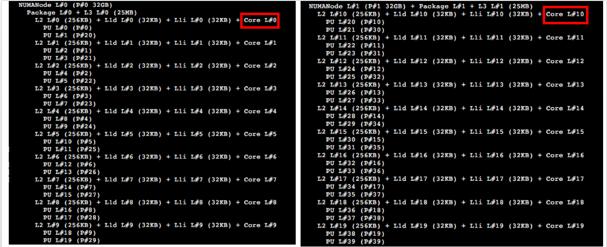
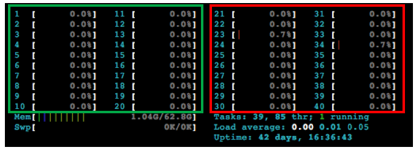
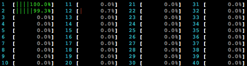
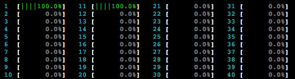
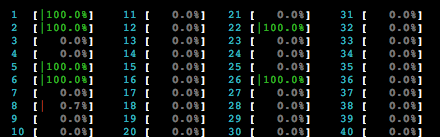
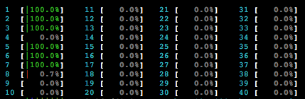
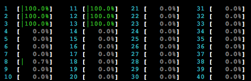
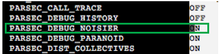
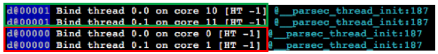

The following will work given the MPI binding is done correctly and hwloc is installed in the system.

To bind computation thread of PaRSEC to actual core, users need to use the parsec_bind option. The easiest way to express binding is through a file.

We will explain all the options available through examples and we will start by explaining the machine we will use as example.

------
Machine configuration: ("*lscpu*")  
- Model name:            Intel(R) Xeon(R) CPU E5-2650 v3 @ 2.30GHz  
- Socket(s):             2  
- Thread(s) per core:    2  
- Core(s) per socket:    10  

By performing "*hwloc-ls*" we get this:  


Here, the black box on the left represents socket-1 and the one on the left represents socket-2. The red box marks the id of the actual physical core on each socket. So, according to *hwloc-ls* the id of first core of socket-1 is 0 and id of the first core of second-socket is 10.

After performing a "*htop*" on the node we see this:  


Here, The section inside green box represents the actual cores and the one inside red box represents the hyper-threaded cores. We will only bind computation threads on actual cores.

------
## Binding 2 cores on same Socket ##

According to what "*hwloc-ls*" showed us, ids in the range "*0-9*" belongs to first socket and ids "*10-19*" belongs to second socket.

Given this, if we want to  bind two computation threads on the same socket we have to provide 2 ids from the range 0-9. For example, let's choose the first two cores of the first socket, then the ids are 0, 1.


We will populate the binding file with the needed information and execute a computation on two cores, binding on the first core of each.


Binding file content:
```
#!c
0,1
```
Here, the line number represents the rank we are trying to provide the binding information for. In this example, we are running shared-memory execution so the rank is 0 and the information needs to reside in the first line. Putting the information in any other line in the file **will not work**.


The binding information is given in comma separated list, where:    
- The first computation thread will be assigned to core with id *0*. (first core of socket 1)  
- The second computation thread will be assigned to core with id *1*. (second core of socket 1)

We will run Cholesky factorization of DPLASMA to demonstrate how to provide the binding information to PaRSEC:  

We will execute:   
```sh
./testing_dpotrf -N 10000 -t 320 -c 2 --
       --parsec_bind file:binding.parsec
```

Here, we are running testing_dpotrf and "-N 10000 -t 320 -c 2" are the arguments for the test where, *-N* is the size of the matrix, *-t* is the size of the tile and ***-c*** determines the number of computation threads we want.


To pass the binding information to PaRSEC we need to use the latter part of the above example "*-- --parsec_bind file:binding.parsec*" where,  
"*-- --parsec_bind*" tells PaRSEC we are passing binding information,  
"*file:binding.parsec*" tells PaRSEC we are passing that information through a file  and the name of the file is "*binding.parsec*".

The file binding.parsec contains the content we have shown earlier in this section.  

We see the following after we run the above command:  



------
## Binding 2 cores on different Socket ##

We will populate the binding file with the needed information and execute a computation on two cores, binding on the first core of each socket.

Binding file content:

```
#!c
0,10
```

The binding information is given in comma separated list, where:    
- The first computation thread will be assigned to core with id *0*. (first core of socket 1)  
- The second computation thread will be assigned to core with id *10*. (first core of socket 2)  

We will run Cholesky factorization of DPLASMA to demonstrate how to provide the binding information to PaRSEC:  

We will execute:   
```sh
./testing_dpotrf -N 10000 -t 320 -c 2 --
        --parsec_bind file:binding.parsec
```


We see the following after we run the above command:  
  


------
## Spawning 2 MPI process with 2 cores each, on the same Socket ##


We will use Open MPI to spawn MPI processes and will use the following rankfile to bind each MPI process.

Rankfile:

```
#!c
rank 0=+n0 slot=0:0                                                                
rank 1=+n0 slot=0:4
```

This rankfile will instruct Open MPI to spawn two MPI processes on core 0 and core 3.

The parsec binding file looks like below:

```
#!c
0,1
4,5
```
Here, the line number represents the rank for which we are trying to provide the binding information. In this example, line 1 represents binding information for rank 0 and line 2 represents information for rank 1.

We will execute the following:  
```sh
mpirun --np 2 --rf mpirankfile ./testing_dpotrf -N 15000 -t 320 -c 2 --
       --parsec_bind file:binding.parsec
```

Here, we are running dpotrf test in two MPI processes, where, the MPI process binding is defined in the rank file named "mpirankfile" and PaRSEC binding information in "binding.parsec"

We see this when we execute the above command:




We see that parsec binding is behaving as intended and there is a communication thread sharing the same core as the second for each process. To dedicate a core to communication thread we can change the binding file as follows:

```
#!c
0,1,2
4,5.6
```

After we run the same command again we see the following:





------
## Spawning 2 MPI process with 2 cores each, on different Socket ##

The rankfile for Open MPI:

```
#!c
rank 0=+n0 slot=0:0                                                                
rank 1=+n0 slot=1:0
```


Binding file for PaRSEC:

```
#!c
0,1,2
10,11.12
```

We execute the following:
```sh
mpirun --np 2 --rf mpirankfile ./testing_dpotrf -N 15000 -t 320 -c 2 --
       --parsec_bind file:binding.parsec
```

We see:




------
## How to check binding if *htop* is not available  ##

To check binding in PaRSEC users will need to:

- Turn debug_verbose **ON**:
* Type "ccmake ." in PaRSEC's build directory and change the option PARSEC_DEBUG_NOISIER to **ON**. If the option is not visible on the default option screen, you can explore the advanced options by pressing "t"
    
* Recompile PaRSEC.  
* Pass the following option to PaRSEC while running a test: "*--mca debug_verbose 10*".  

Running the following command:


```sh
mpirun --np 2 --rf mpirankfile ./testing_dpotrf -N 1 -t 1 -c 2 --
       --parsec_bind file:binding.parsec --mca debug_verbose 10
```

Here, first part of the command is the same as previous section and we added the mca parameter to indicate we want more information from PaRSEC. We used the same rankfile and binding file as the previous section.

We get a bunch of output among which are the binding information that PaRSEC used:



In the above picture, we see the output we are interested in. The red and green box indicates the rank. If we notice the blue highlighted part of each box, we will see how to know the rank this information belongs to.

The red box have binding information for rank 0 and the green box have it for rank 1. The core id is given at the end and we get as many lines as computation cores we have requested to PaRSEC (2 in this case). We can see that, the binding of the computation thread happened according to what was described in the binding file.
